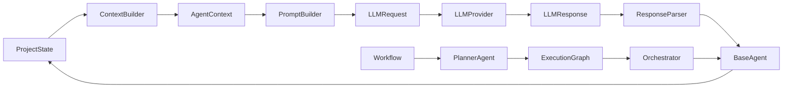

# software-team-ai

Agent Harness en Python que transforma un objetivo de software en artefactos estructurados mediante un equipo de agentes orquestados con LLM.

El flujo por defecto toma una descripción de proyecto (por ejemplo, una app móvil para una barbería) y produce historias de usuario, arquitectura, tareas de desarrollo, acciones de filesystem y un reporte QA.

## Características

- **Multi-provider LLM**: `mock`, `openai`, `claude`, `gemini`
- **Pipeline LLM por agente**: prompt → provider → parser → `ProjectState`
- **Agent Registry**: registro desacoplado de agentes, capacidades y factories
- **Planner dinámico**: plan de ejecución generado por LLM con fallback determinista
- **Execution Graph + Policy**: grafo de nodos con política de recorrido
- **Tools y acciones**: filesystem, terminal y acciones ejecutables post-developer
- **Reviewer y Quality** (standalone): revisión y evaluación de calidad reutilizables, aún no integrados al workflow principal

## Requisitos

- Python 3.10+
- Dependencias en `requirements.txt`

## Instalación

```bash
python3 -m venv .venv
source .venv/bin/activate
pip install -r requirements.txt
```

## Ejecución

Con el proveedor simulado (sin APIs externas):

```bash
LLM_PROVIDER=mock python3 main.py
```

Con un proveedor real:

```bash
# OpenAI
export LLM_PROVIDER=openai
export OPENAI_API_KEY=sk-...
export LLM_MODEL=gpt-4o-mini   # opcional
python3 main.py

# Claude
export LLM_PROVIDER=claude
export ANTHROPIC_API_KEY=sk-ant-...
python3 main.py

# Gemini
export LLM_PROVIDER=gemini
export GOOGLE_API_KEY=...
# o export GEMINI_API_KEY=...
python3 main.py
```

La salida incluye el proveedor activo, la fuente del plan (`planner_llm`) y la fuente de artefactos del Developer (`developer_llm` cuando la respuesta JSON es válida).

### Variables de entorno

| Variable | Descripción | Default |
|---|---|---|
| `LLM_PROVIDER` | Proveedor LLM (`mock`, `openai`, `claude`, `gemini`) | `mock` |
| `LLM_MODEL` | Modelo a usar | depende del provider |
| `LLM_FIXED_DURATION_MS` | Duración mínima simulada del mock | `5` |
| `OPENAI_API_KEY` | API key de OpenAI | — |
| `ANTHROPIC_API_KEY` | API key de Anthropic | — |
| `GOOGLE_API_KEY` | API key de Google Gemini | — |
| `GEMINI_API_KEY` | Alias de `GOOGLE_API_KEY` | — |

## Tests

```bash
python3 -m pytest
```

## Arquitectura



### Flujo de creación de software

1. **PlannerAgent** genera un `ExecutionPlan` (LLM o fallback).
2. **AgentRegistry** instancia los agentes del plan.
3. **ExecutionGraph** conecta los nodos en secuencia lineal.
4. **Orchestrator** ejecuta cada agente y procesa acciones pendientes.

Orden por defecto:

```
analyst → architect → developer → qa
```

| Agente | Rol |
|---|---|
| Business Analyst | Historias de usuario |
| Software Architect | SDD y arquitectura |
| Flutter Developer | Tareas y acciones de filesystem |
| QA Engineer | Reporte de calidad |

## Estructura del proyecto

```
agents/          Agentes, BaseAgent, AgentRegistry, AgentResult
actions/         Acciones ejecutables (crear archivos, directorios)
context/         AgentContext y ContextBuilder
execution/       ExecutionGraph, ExecutionPolicy, ExecutionHistory
llm/             Providers, factory, configuración
memory/          MemoryStore y AgentMemory
orchestrator/    Coordinación secuencial de agentes
parsers/         Parsers JSON por agente
planning/        PlannerAgent, ExecutionPlan
prompts/         Prompts por agente
quality/         QualityEvaluator, QualityDecision (standalone)
review/          ReviewerAgent, ReviewResult (standalone)
state/           ProjectState compartido
tools/           FileSystemTool, TerminalTool
workflows/       Composición del flujo software_creation
tests/           Suite de tests (pytest)
main.py          Demo del flujo completo
```

## Componentes destacados

### Agent Registry

Fuente única de verdad para ids, capacidades y factories de agentes. Usado por el Planner (prompt y parser) y por el workflow para instanciar agentes.

```python
from agents.agent_registry import create_default_registry

registry = create_default_registry()
agents = registry.build_agents(llm_provider, memory_store)
```

### Planner

Genera el plan de ejecución a partir del objetivo del proyecto. Si el LLM falla, usa un fallback determinista con el orden del registry.

### Reviewer y Quality (fase actual)

Módulos reutilizables que **no modifican** el workflow ni la `ExecutionPolicy`:

```python
from review import ReviewerAgent
from quality import QualityEvaluator

review = ReviewerAgent(llm_provider).review(
    reviewed_agent="analyst",
    objective="Mi app",
    agent_output={"user_stories": ["..."]},
)
decision = QualityEvaluator().evaluate(review)
```

Reglas de calidad:

- `approved=True` y `score >= 0.75` → pasa
- `approved=False` → no pasa, `retry=True`
- `approved=True` y `score < 0.75` → no pasa, `retry=True`

## Salida de `main.py`

La demo imprime:

- Historias de usuario
- Software Design Document
- Arquitectura
- Tareas de desarrollo
- Artefactos generados y su fuente (`developer_llm` / `developer_fallback`)
- Reporte QA
- Execution history
- Logs de ejecución

Los artefactos generados por el developer se escriben en `projects/<nombre-proyecto>/`.

## Licencia

Proyecto interno de desarrollo. Ajustar según la política del repositorio.
