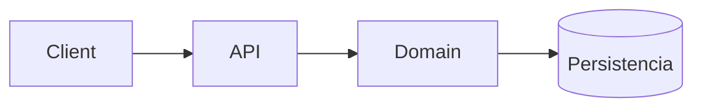

# Arquitectura — [Nombre del proyecto]

> Fuente de verdad técnica. Mantenido por Architect.

## Stack

| Capa | Tecnología | Justificación |
|------|------------|---------------|

## Diagrama de componentes



## Estructura de carpetas

```text
projects/
└── <nombre-proyecto>/    # Código fuente (frontend, backend, etc.)
```

Documenta aquí la estructura interna acordada (p. ej. Clean Architecture por features).

## Módulos y responsabilidades

| Módulo | Responsabilidad |
|--------|-----------------|

## Modelo de datos

## Flujos principales

## Decisiones técnicas (ADRs)

### ADR-001 — [Título]
- **Contexto:**
- **Decisión:**
- **Consecuencias:**

## Seguridad

## Restricciones

## Riesgos técnicos

## Historial

| Fecha | Autor | Cambio |
|-------|-------|--------|
| | Architect | Arquitectura inicial |
