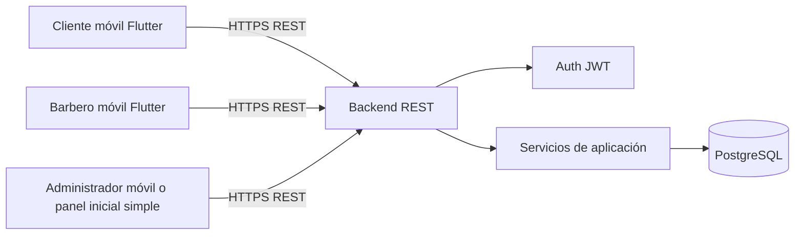
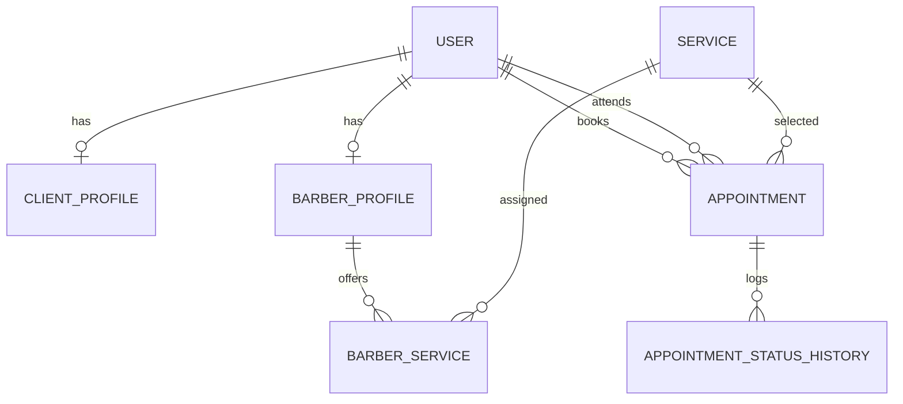

# Arquitectura — Barbería App

> Documento vivo. Actualizado por el **Architect Agent** en Cursor.  
> Versión: 1.0 — 2026-07-08

## Resumen ejecutivo

Se define una arquitectura **mobile-first** con:

- **Frontend:** Flutter para Android/iOS
- **Backend:** API REST separada
- **Base de datos:** PostgreSQL
- **Autenticación:** JWT con refresh token

La base actual en `projects/barberia-app/` **sirve solo como bootstrap técnico** (`pubspec.yaml`, proyecto Flutter válido), pero **no sirve como base funcional ni estructural** para el MVP porque hoy contiene únicamente un `Hello World`.  
La decisión es **migrar la estructura interna** del frontend manteniendo el proyecto Flutter existente como punto de partida.

---

## Stack

| Capa | Tecnología | Versión objetivo | Justificación |
|------|------------|------------------|---------------|
| Frontend móvil | Flutter | SDK 3.x | Un solo código para Android/iOS, buena velocidad de desarrollo y UI consistente |
| Gestión de estado | Riverpod | estable actual | Escalable, testeable y adecuado para modularizar features |
| Navegación | GoRouter | estable actual | Rutas declarativas, guards de autenticación, deep-linking |
| Networking | Dio | estable actual | Interceptores, manejo de errores, tokens, timeouts |
| Persistencia local segura | flutter_secure_storage | estable actual | Guardar JWT/refresh token de forma segura |
| Backend API | FastAPI | Python 3.11+ | Productividad alta, tipado, documentación OpenAPI automática |
| ORM / acceso DB | SQLAlchemy | 2.x | Estándar maduro para dominio relacional |
| Base de datos | PostgreSQL | 15+ | Integridad relacional, transacciones y soporte fuerte para reservas |
| Cache / async diferido | No requerido en MVP | — | Evitar complejidad prematura |
| Tests frontend | flutter_test | SDK | Cobertura básica UI / viewmodels |
| Tests backend | pytest | estable actual | Cobertura de reglas de negocio y endpoints |

---

## Objetivos arquitectónicos

1. Evitar doble reserva de horarios.
2. Separar claramente frontend móvil y backend.
3. Permitir evolución futura a notificaciones, pagos y analítica avanzada.
4. Mantener el MVP simple, implementable y modular.
5. Diseñar un modelo de datos consistente con reglas de negocio del SPEC.

---

## Estado actual del proyecto base

### `projects/barberia-app/`

Estado detectado:

- Proyecto Flutter válido
- `pubspec.yaml` mínimo
- `lib/main.dart` con `Hello World`
- Sin estructura modular
- Sin autenticación
- Sin dominio, datos ni presentación por features

### Decisión

**Reutilizar la base Flutter existente** para:

- conservar el bootstrap del proyecto,
- evitar recrear configuración básica del SDK,
- y migrar la estructura interna a una arquitectura modular.

No se reutiliza la implementación actual, solo la base del proyecto.

---

## Arquitectura general



### Responsabilidades por capa

- **Flutter app**
  - UI, navegación, validaciones básicas de formulario
  - Consumo de API
  - Estado local/transitorio
  - Persistencia segura de sesión

- **Backend REST**
  - Reglas de negocio
  - Autorización por rol
  - Validación de conflictos de agenda
  - Persistencia y consistencia transaccional

- **Base de datos**
  - Integridad relacional
  - Restricciones únicas y consulta histórica

---

## Arquitectura frontend

### Estilo

Se propone **Feature-First + capas ligeras** dentro de Flutter:

- `core/` para cross-cutting concerns
- `features/` para dominios del negocio
- `shared/` para componentes reutilizables

### Estructura implementada (T-001 — T-005)

```text
projects/barberia-app/
├── lib/
│   ├── app/
│   │   ├── providers/          # router + estado global UI
│   │   ├── router/             # GoRouter, guards, redirect
│   │   ├── presentation/       # shells
│   │   ├── state/              # AppState global
│   │   ├── theme/
│   │   └── app.dart
│   ├── core/
│   │   ├── application/        # UseCase base
│   │   ├── config/             # ambientes (APP_ENV)
│   │   ├── constants/
│   │   ├── error/              # Failure, Exception, mappers
│   │   ├── navigation/         # AuthSession, UserRole, SessionNotifier
│   │   ├── network/            # Dio, interceptores, RemoteDataSource
│   │   ├── providers/          # DI Riverpod (config, network, storage)
│   │   ├── storage/            # flutter_secure_storage, SessionPersistence
│   │   └── utils/              # Result<T>
│   ├── shared/
│   │   └── widgets/
│   ├── features/
│   │   └── <feature>/
│   │       ├── domain/
│   │       ├── data/
│   │       ├── application/
│   │       └── presentation/
│   └── main.dart
├── test/
└── pubspec.yaml
```

### Patrón por feature

```text
feature/
├── data/
│   ├── datasources/
│   ├── models/              # DTOs
│   └── repositories/
├── domain/
│   ├── entities/
│   ├── repositories/        # contratos
│   └── usecases/
├── application/
│   └── usecases/            # orquestación
└── presentation/
    ├── pages/
    ├── widgets/
    └── providers/
```

### Sesión y seguridad frontend (T-004, T-005)

- Tokens JWT en `flutter_secure_storage` vía `SessionPersistence`
- `AuthInterceptor` agrega `Authorization: Bearer`
- `UnauthorizedInterceptor` limpia sesión en 401
- Bootstrap al iniciar: `sessionBootstrapProvider` restaura sesión
- Refresh token real: implementado T-031 (`refresh_tokens` + rotación)

### Módulos frontend

| Módulo | Responsabilidad |
|--------|-----------------|
| `auth` | login, registro, sesión, roles |
| `services` | listado de servicios activos |
| `client_booking` | consulta de disponibilidad, reserva, cancelación |
| `appointments` | historial y detalle de citas |
| `barber_schedule` | disponibilidad y agenda del barbero |
| `admin_management` | gestión de barberos, clientes, servicios y horarios |
| `profile` | perfil cliente / barbero |

### Patrón por feature

```text
feature/
├── data/
│   ├── datasources/
│   ├── models/              # DTOs
│   └── repositories/
├── domain/
│   ├── entities/
│   ├── repositories/        # contratos (repository_contracts)
│   └── usecases/
├── application/
│   └── usecases/
└── presentation/
    ├── pages/
    ├── widgets/
    └── providers/
```

> **Nota:** La capa `application/` fue añadida en T-001 para separar casos de uso de entidades puras.

### Rutas principales

- `/login`
- `/register`
- `/home`
- `/services`
- `/book-appointment`
- `/appointments`
- `/profile`
- `/barber/schedule`
- `/barber/availability`
- `/admin/dashboard`
- `/admin/services`
- `/admin/barbers`
- `/admin/users`
- `/admin/business-hours`

---

## Arquitectura backend

### Estilo

Backend REST modular por dominio, con capas:

- `api/` endpoints
- `application/` casos de uso
- `domain/` entidades y reglas
- `infrastructure/` persistencia y adaptadores

### Estructura propuesta (implementada en `projects/barberia-api/`)

```text
projects/barberia-api/
├── app/
│   ├── api/
│   │   ├── v1/
│   │   │   ├── auth.py
│   │   │   ├── users.py          # GET/PATCH /me
│   │   │   ├── barbers.py
│   │   │   ├── services.py
│   │   │   ├── appointments.py
│   │   │   ├── availability.py
│   │   │   └── admin.py
│   ├── application/
│   │   ├── auth/
│   │   ├── appointments/
│   │   ├── availability/
│   │   └── admin/
│   ├── domain/
│   │   ├── enums.py              # UserRole, AppointmentStatus, Weekday
│   │   └── contracts.py
│   ├── infrastructure/
│   │   ├── db/
│   │   ├── repositories/
│   │   └── security/
│   ├── schemas/
│   └── main.py
├── alembic/
├── tests/
├── docker-compose.yml
└── requirements.txt
```

**Estado Fase 1 (T-006..T-008):** esqueleto operativo con endpoints stub (`501`) y migración inicial vacía.

**Estado Fase 2 (T-020..T-025):** modelo relacional completo en PostgreSQL con modelos SQLAlchemy en `app/infrastructure/db/models/` y migraciones `0002_domain_tables`, `0003_appointment_constraints`.

### Estructura original de referencia

```text
backend/
├── app/
│   ├── api/
│   │   ├── v1/
│   │   │   ├── auth.py
│   │   │   ├── users.py
│   │   │   ├── barbers.py
│   │   │   ├── services.py
│   │   │   ├── appointments.py
│   │   │   └── admin.py
│   ├── application/
│   │   ├── auth/
│   │   ├── appointments/
│   │   ├── availability/
│   │   └── admin/
│   ├── domain/
│   │   ├── users/
│   │   ├── services/
│   │   ├── appointments/
│   │   └── schedules/
│   ├── infrastructure/
│   │   ├── db/
│   │   ├── repositories/
│   │   └── security/
│   ├── schemas/
│   └── main.py
├── tests/
└── requirements.txt
```

### Endpoints MVP

| Área | Endpoint | Uso |
|------|----------|-----|
| Auth | `POST /auth/register` | Registro cliente |
| Auth | `POST /auth/login` | Login |
| Auth | `POST /auth/refresh` | Renovar sesión |
| Users | `GET /me` | Perfil actual |
| Users | `PATCH /me` | Editar perfil |
| Services | `GET /services` | Listar servicios activos |
| Barbers | `GET /barbers` | Listar barberos activos |
| Availability | `GET /availability` | Consultar slots por servicio/fecha |
| Appointments | `POST /appointments` | Crear cita |
| Appointments | `GET /appointments` | Listado por rol |
| Appointments | `PATCH /appointments/{id}/cancel` | Cancelar cita |
| Barber | `PATCH /barber/availability` | Definir disponibilidad |
| Barber | `PATCH /barber/appointments/{id}/status` | Cambiar estado |
| Admin | `CRUD /admin/services` | Gestionar servicios |
| Admin | `CRUD /admin/barbers` | Gestionar barberos |
| Admin | `GET /admin/users` | Gestionar clientes |
| Admin | `PATCH /admin/business-hours` | Configurar horario |
| Admin | `PATCH /admin/appointments/{id}/void` | Anular cita |

---

## Modelo de datos inicial

### Entidades principales

#### 1. User

Representa una identidad autenticable.

| Campo | Tipo | Notas |
|-------|------|-------|
| `id` | UUID | PK |
| `email` | string | único |
| `password_hash` | string | no reversible |
| `role` | enum | `client`, `barber`, `admin` |
| `is_active` | bool | control de acceso |
| `created_at` | datetime | auditoría |
| `updated_at` | datetime | auditoría |

#### 2. ClientProfile

| Campo | Tipo | Notas |
|-------|------|-------|
| `user_id` | UUID | PK/FK a User |
| `full_name` | string | obligatorio |
| `phone` | string | obligatorio |
| `notes` | text | opcional futuro |

#### 3. BarberProfile

| Campo | Tipo | Notas |
|-------|------|-------|
| `user_id` | UUID | PK/FK a User |
| `display_name` | string | visible al cliente |
| `bio` | text | opcional |
| `photo_url` | string | opcional MVP |
| `is_bookable` | bool | si puede recibir citas |

#### 4. Service

| Campo | Tipo | Notas |
|-------|------|-------|
| `id` | UUID | PK |
| `name` | string | obligatorio |
| `description` | text | opcional |
| `duration_minutes` | int | obligatorio |
| `price_dop` | decimal(10,2) | moneda DOP |
| `is_active` | bool | control catálogo |

#### 5. BarberService

Relación N:M entre barbero y servicios.

| Campo | Tipo | Notas |
|-------|------|-------|
| `barber_user_id` | UUID | FK |
| `service_id` | UUID | FK |

Restricción: `UNIQUE(barber_user_id, service_id)`

#### 6. BusinessHours

Horario general del local.

| Campo | Tipo | Notas |
|-------|------|-------|
| `id` | UUID | PK |
| `weekday` | int | 1-7 |
| `open_time` | time | |
| `close_time` | time | |
| `is_closed` | bool | festivo o cierre |

#### 7. BarberAvailability

Disponibilidad recurrente del barbero.

| Campo | Tipo | Notas |
|-------|------|-------|
| `id` | UUID | PK |
| `barber_user_id` | UUID | FK |
| `weekday` | int | 1-7 |
| `start_time` | time | |
| `end_time` | time | |
| `is_active` | bool | |

#### 8. Appointment

| Campo | Tipo | Notas |
|-------|------|-------|
| `id` | UUID | PK |
| `client_user_id` | UUID | FK |
| `barber_user_id` | UUID | FK |
| `service_id` | UUID | FK |
| `scheduled_start` | datetime | obligatorio |
| `scheduled_end` | datetime | derivado por duración |
| `status` | enum | `confirmada`, `en_progreso`, `completada`, `cancelada`, `no_show` |
| `cancellation_reason` | text | opcional |
| `cancelled_at` | datetime | opcional |
| `created_at` | datetime | |
| `updated_at` | datetime | |

Restricciones:

- `scheduled_start < scheduled_end`
- no overlap para el mismo `barber_user_id`
- cita siempre asociada a `client_user_id`, `barber_user_id`, `service_id`

#### 9. AppointmentStatusHistory

| Campo | Tipo | Notas |
|-------|------|-------|
| `id` | UUID | PK |
| `appointment_id` | UUID | FK |
| `from_status` | enum | opcional |
| `to_status` | enum | obligatorio |
| `changed_by_user_id` | UUID | FK |
| `changed_at` | datetime | auditoría |

#### 10. AuditLog

| Campo | Tipo | Notas |
|-------|------|-------|
| `id` | UUID | PK |
| `actor_user_id` | UUID | FK |
| `action` | string | ej. `appointment_voided` |
| `entity_type` | string | |
| `entity_id` | UUID | |
| `metadata_json` | jsonb | |
| `created_at` | datetime | |

---

## Relaciones clave



---

## Reglas de consistencia técnica

1. **Doble reserva**
   - Se resuelve en backend.
   - La creación de cita debe ser transaccional.
   - Validación por rango: mismo barbero, mismo intervalo, sin solapamiento.

2. **Confirmación automática**
   - Como la reserva es automática cuando hay disponibilidad, el estado inicial recomendado es `confirmada`.
   - Se elimina necesidad de aprobación manual del barbero en MVP.

3. **Cancelación**
   - Backend valida regla de 2 horas antes de `scheduled_start`.

4. **Servicios por barbero**
   - Solo se muestran slots de barberos que tengan asignado el servicio solicitado.

5. **Duración**
   - `scheduled_end = scheduled_start + service.duration_minutes`

---

## Flujos principales

### Flujo 1 — Reserva de cita

1. Cliente inicia sesión.
2. Consulta servicios activos.
3. Selecciona servicio y fecha.
4. App solicita disponibilidad a API.
5. API filtra barberos activos con ese servicio y slots válidos.
6. Cliente elige barbero y horario.
7. API crea la cita en transacción.
8. Sistema devuelve cita en estado `confirmada`.

### Flujo 2 — Cancelación de cita

1. Cliente abre sus citas futuras.
2. Solicita cancelación.
3. API valida propiedad de la cita y regla de 2 horas.
4. Si es válida, cambia estado a `cancelada`.
5. Slot vuelve a estar disponible.

### Flujo 3 — Gestión de agenda del barbero

1. Barbero consulta agenda diaria.
2. Ve citas por orden cronológico.
3. Cambia estado: `confirmada` → `en_progreso` → `completada`.
4. Si cliente no asiste, marca `no_show`.
5. Cambio queda registrado en historial.

### Flujo 4 — Administración operativa

1. Admin gestiona catálogo de servicios.
2. Admin gestiona barberos y les asigna servicios.
3. Admin configura horario del local.
4. Admin desactiva usuarios o anula citas si hay incidencias.

---

## Seguridad y autorización

### Roles

- `client`
- `barber`
- `admin`

### Reglas

- Cliente solo accede a sus datos y citas.
- Barbero solo accede a su agenda, disponibilidad y citas asignadas.
- Admin tiene acceso administrativo sobre catálogo, personal, horarios y soporte operativo.

### Autenticación

- JWT short-lived
- Refresh token
- Tokens almacenados de forma segura en el dispositivo

---

## Estrategia de errores

### Frontend

- Mostrar mensajes de error comprensibles:
  - horario no disponible
  - sesión expirada
  - error de conexión

### Backend

- Errores semánticos con códigos claros:
  - `400` validación
  - `401` autenticación
  - `403` autorización
  - `404` entidad no encontrada
  - `409` conflicto de reserva

---

## Estrategia de migración del proyecto actual

### Qué se conserva

- `projects/barberia-app/pubspec.yaml`
- configuración básica Flutter
- nombre del proyecto actual

### Qué se reemplaza

- `lib/main.dart` hello world
- estructura plana actual de `lib/`
- README técnico generado automáticamente

### Conclusión

La base **es utilizable como contenedor Flutter**, pero requiere **migración completa de estructura interna** antes de implementar funcionalidades.

---

## Decisiones técnicas justificadas

| # | Decisión | Alternativas | Razón |
|---|----------|--------------|-------|
| 1 | Flutter móvil nativo para Android/iOS | Web responsive, React Native | Requisito aprobado por producto y mejor alineación con experiencia móvil |
| 2 | Backend REST separado | Firebase full BaaS, Supabase | Mejor control de reglas de negocio, auth por roles y conflictos de agenda |
| 3 | PostgreSQL | SQLite, MongoDB | Modelo relacional fuerte para citas, usuarios, servicios y restricciones |
| 4 | Riverpod | Bloc, Provider | Simplicidad, testabilidad y modularidad por feature |
| 5 | FastAPI | Node/NestJS, Django | Velocidad de desarrollo, OpenAPI y claridad para MVP |
| 6 | Estado inicial de cita `confirmada` | `pendiente` con aprobación manual | Producto definió confirmación automática si hay disponibilidad |
| 7 | Reutilizar proyecto Flutter actual y migrar estructura | Crear app nueva | Ahorra bootstrap inicial sin comprometer arquitectura final |
| 8 | Arquitectura feature-first + capas | MVC simple | Escala mejor con múltiples roles y dominios |

---

## Restricciones

- No implementar pagos en MVP.
- No implementar notificaciones automáticas en MVP.
- Una sola barbería en MVP.
- Moneda fija: DOP.
- La lógica crítica de disponibilidad debe vivir en backend, no en cliente.

---

## Riesgos técnicos

- Solapamientos de citas si la validación no es transaccional.
- Complejidad de roles si frontend intenta mezclar demasiadas pantallas en un solo flujo sin guards.
- Riesgo de deuda técnica si se implementa el panel admin en la misma app sin separación modular suficiente.
- Riesgo de UX si no se diseña bien la selección de slots por duración variable del servicio.

---

## Historial

| Fecha | Autor | Cambio |
|-------|-------|--------|
| 2026-07-08 | Architect | Arquitectura inicial aprobada para Barbería App |
